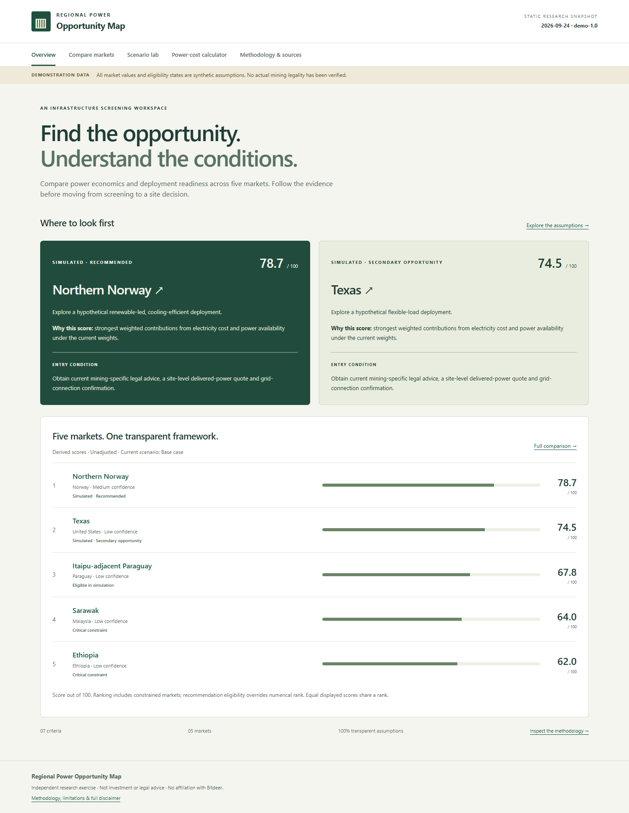

# Regional Power Opportunity Map

A complete client-side React + TypeScript + Vite screening workspace for five regional power markets. All supplied market values, price scenarios and eligibility states are **synthetic demonstration assumptions**. No actual mining legality has been verified; simulated recommendations are not research conclusions.



[Mobile screenshot](docs/mobile.png) · [Verification report](docs/verification.md) · [Product requirements](PRD.md)

## Run locally

Use Node.js 22.12+ (tested with Node 24) and npm:

```sh
git clone https://github.com/cliffordpang0/test.git
cd test
npm ci
npm run dev
```

Open http://127.0.0.1:5173. No accounts, API keys or external data services are needed. Dependencies are required only at installation/build time.

## Checks

```sh
npm run validate
npm test
npm run lint
npm run build
npm run test:e2e
```

Browser tests use installed Microsoft Edge. To use bundled Chromium instead, remove `channel: 'msedge'` from `playwright.config.ts` and run `npx playwright install chromium`. The suite covers the main workflow, keyboard disclosures, mobile overflow, downloads and automated WCAG checks. `npm run format` formats application files. The production bundle is written to `dist/`; inspect it with `npm run preview`.

## What is included

- Executive recommendations and ranked bars with textual scores.
- Seven-criterion comparison, criterion sorting, confidence and evidence ages.
- Deep-linkable market details such as `/#markets/norway`.
- Four presets, custom weight sliders, reset and confidence adjustment.
- Annual electricity/hosting calculator and one-cent sensitivity.
- Methodology, scoring guides, research gaps, source register and three CSV downloads.
- Explicit empty, invalid-snapshot, missing-observation and unknown-route states.

There is no network loading state: the dataset ships synchronously inside the bundle. The app works when source sites are offline. Hash navigation supports static hosting without rewrite rules. All calculations use full precision, while one-decimal score ties share rank. Equal eligible scores at the recommendation boundary remain tied, so a tie may produce more than two badges. Displayed weight tenths use largest-remainder rounding to total exactly 100.0%.

## Replace demonstration data

1. Review `PRD.md`, then edit `src/data.ts`. `loadDataset()` is the small repository boundary. Models are in `src/models.ts`; criteria, guides, default weights, confidence factors and presets are in `src/config.ts`.
2. Add sources with genuine title, publisher, HTTP(S) URL, publication date when available, access date, geography and source type. Link observations through `sourceIds`; associated criteria and confidence are derived from those references. Do not add suggested sources as if they had been accessed.
3. Replace all 35 assumptions with researched observations or explicit, justified assessments. The MVP requires exactly one scored observation per market/criterion. Multiple supporting sources may be attached to that observation. Preserve null raw values and explain any score assigned despite a gap.
4. Record ISO reporting dates, units, geography, confidence and rationale. Distinguish industrial averages, tariffs, wholesale prices, estimated delivered prices, scenarios and reported negotiated prices. Price scenarios are always model inputs, not available offers.
5. Replace illustrative commercial profiles and collect separate general-risk and mining-specific legal assessments. Set legal eligibility and a real `legalCheckedAt` date. Research mode refuses recommendations if that date is missing, future-dated or over 90 days old at viewing time.
6. Update version and snapshot, set `demonstration: false`, and revise demonstration-specific UI copy in `src/App.tsx` as part of research publication. These conservative labels are deliberately not automatically removed merely by changing data.
7. Run validation, tests, build and browser checks. Review source destinations, access dates, price units, legal evidence, and recommendation rationale manually before publication.

The current source register is intentionally empty. Its CSV is header-only; the filename includes snapshot/version. Observation and score rows contain snapshot/version columns. Score exports use the active scenario and confidence toggle; null CSV cells are blank, never zero. Spreadsheet formula-like text is escaped.

## Deploy

Run `npm ci && npm run build`, then upload **the contents of `dist/`** to any static host (for example GitHub Pages). Relative asset paths support a project subdirectory; `index.html` is the entry page. No server, database, paid service or live-data connection is required. Do not upload `node_modules/`. No deployment has been performed automatically.

## Research and verification limits

The implementation exercises the MVP with demonstration data; it does not complete the research phase. Primary-source evidence, site-level delivered prices/capacity, current mining legal checks, and supported market commentary remain outstanding. Browser automation checks Edge at mobile/tablet/desktop widths; Safari/Firefox and a human screen-reader review remain separate release checks. Automated accessibility scans do not establish full WCAG conformance.

This independent research exercise is not affiliated with Bitdeer and is not investment, legal, tariff or project-development advice. It makes no offer of electricity, hosting or equipment.

